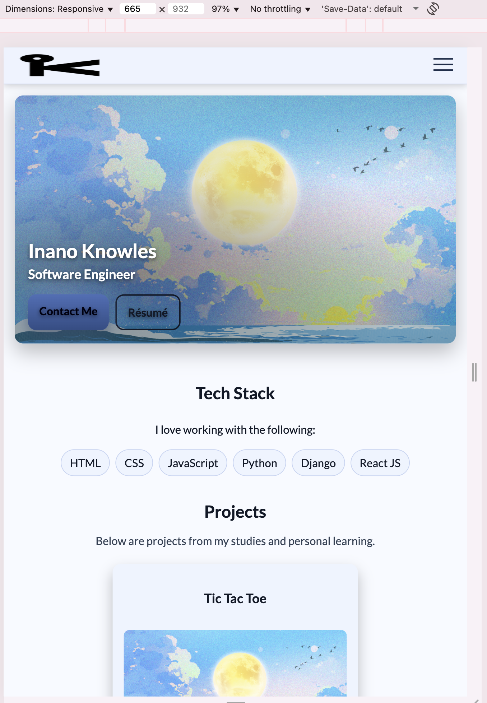

#  Inano Knowles - Portfolio Task
​
[My portfolio site](https://inanoknowles.github.io/)
​
## Project Requirements

### Content
 Add a short paragraph describing the features below. What aesthetic and technical choices did you make? 
- [:heavy_check_mark:] At least one profile picture
- [:heavy_check_mark:] Biography (at least 100 words)
- [:heavy_check_mark:] Unfunctional Contact Form
- [:heavy_check_mark:] "Projects" section
- [:heavy_check_mark:] Links to external sites, e.g. GitHub and LinkedIn.
​
### Technical
 Add a short paragraph describing the features below. What strategies or design decisions did you work from? 
- [:heavy_check_mark:] At least 2 web pages.
- [:heavy_check_mark:] Version controlled with Git
- [:heavy_check_mark:] Deployed on GitHub pages.
- [:heavy_check_mark:] Implements responsive design principles.
- [:heavy_check_mark:] Uses semantic HTML.

### Bonus (optional)
- [:heavy_check_mark:] Add a short paragraph describing the features below, if you included any. 
- [:heavy_check_mark:] Different styles for active, hover and focus states.
- [:heavy_check_mark:] Include JavaScript to add some dynamic elements to your site. (Extra tricky!)

## Feature Description:
I built a two page portfolio that is easy to use. Navigation uses clean white buttons with black borders that turn bright blue on hover or focus, and the Light or Dark toggle remembers your choice. The logo switches to suit the theme for clear contrast. On mobile, a hamburger menu opens and closes accessibly, including Escape and click outside behaviour. Projects link to live demos and repositories. The About page uses left-aligned timelines for experience and education. A preferred contact card and a left-aligned contact form provide ways to reach me, with validation, status messages, and keyboard-friendly focus styles.

## Features on the Home Page:
- Navigation buttons (Home, About): white buttons with a black border that turn bright blue with a soft glow on hover or keyboard focus so it is obvious they are clickable.
- Light or Dark mode toggle: a small button that switches the site between light and dark colour schemes and remembers your choice for next time.
- Logo swap: the site logo automatically switches to a light or dark version so it stays readable when you change theme.
- Mobile hamburger menu: a three-line button that opens and closes the navigation on small screens, closes on Escape or when you click outside and keeps its state in sync.
- Hero call to actions: prominent Contact me and Résumé buttons that use the same interactive states and let you download the PDF directly.
- Projects grid buttons: Play now opens the live demo and Repository opens the code in a new tab with the same hover, focus and active behaviour.
- Skip link: a hidden link that appears when you tab with the keyboard so you can jump straight to the main content.

## Features on the About Page:
- Hero call to actions: Contact me and Résumé buttons with the same clear hover, focus and active states for consistency.
- Header logo swap: the header logo also swaps between light and dark versions to match the active theme.
- Experience timeline: a vertical list with dots and dates that presents roles in order with all text left aligned for easier reading.
- Education timeline: the same timeline component used for qualifications so the layout matches Experience and remains left aligned.
- Preferred contact: a simple card with GitHub, LinkedIn and Gmail buttons so you can reach me quickly using your preferred method.
- Contact form fields: Full name, Email, Subject and Message are left aligned on every screen size to improve readability and scanning.
- Contact form behaviour: the form checks required fields, opens your email app with a pre-filled message, resets itself and shows a status message that screen readers can announce.

### Screenshots of The Different Features

​
### Screenshots of Different Screen Sizes

####  Home Page - Desktop Annotated (Light Mode)

####  Home Page - Desktop Annotated (Dark Mode)

####  Home Page - Different Screen Sizes (Light Mode)
##### Small:

##### Medium:

##### Big:

####  Home Page - Different Screen Sizes (Dark Mode)
##### Small:

##### Medium:

##### Big:

####  About Page - Different Screen Sizes (Light Mode)
##### Small:

##### Medium:

##### Big:

####  About Page - Different Screen Sizes (Dark Mode)
##### Small:

##### Medium:

##### Big:
